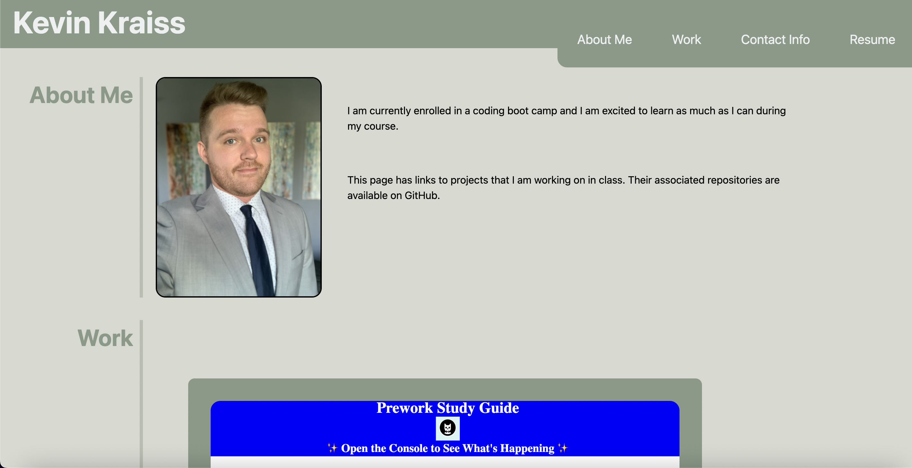

# developer-portfolio
This is a collection of my recent projects placed into a portfolio page.

The purpose of this page is to give potential employers a way to acces material I have worked on in class. 

attached is a screenshot of the portfolio

